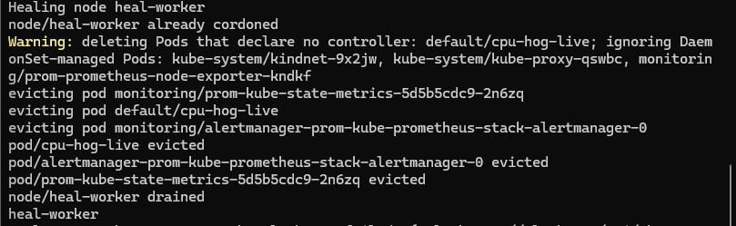

# Node Auto-Heal Pipeline

Fully automated Kubernetes self-healing using Prometheus, Alertmanager, and a custom webhook.


## Overview

```
High CPU → Prometheus Alert → Alertmanager → Webhook → Node Cordoned
```

This project demonstrates automated node remediation without manual intervention:
- Prometheus monitors node metrics via node-exporter
- Alert fires when CPU threshold exceeded
- Alertmanager routes `heal=true` alerts to webhook
- Webhook cordons unhealthy worker nodes
- Control-plane nodes are protected

## Architecture

```
┌─────────────────┐     ┌─────────────────┐     ┌─────────────────┐     ┌─────────────────┐
│   Node          │────▶│   Prometheus    │────▶│  Alertmanager   │────▶│    Webhook      │
│   Exporter      │     │  (Alert Rule)   │     │   (Routing)     │     │   (Cordon)      │
│                 │     │                 │     │                 │     │                 │
│ Scrapes metrics │     │ Evaluates rules │     │ Routes by label │     │ Patches node    │
│ every 30s       │     │ heal=true label │     │ heal=true →     │     │ unschedulable   │
└─────────────────┘     └─────────────────┘     │ webhook         │     └─────────────────┘
                                                └─────────────────┘
```

## Quick Start

### Prerequisites
- Docker
- kind
- kubectl
- Helm

### Deploy

```bash
# 1. Create cluster
kind create cluster --name heal --config kind-config.yaml

# 2. Install Prometheus stack
helm repo add prometheus-community https://prometheus-community.github.io/helm-charts
helm install prom prometheus-community/kube-prometheus-stack -n monitoring --create-namespace

# 3. Wait for pods
kubectl -n monitoring wait --for=condition=ready pod -l app.kubernetes.io/name=prometheus --timeout=300s

# 4. Deploy webhook
kubectl apply -f webhook-deployment.yaml

# 5. Apply alert rule
kubectl apply -f alert-rule.yaml

# 6. Configure Alertmanager routing
kubectl apply -f alertmanager-secret.yaml
kubectl -n monitoring rollout restart statefulset alertmanager-prom-kube-prometheus-stack-alertmanager

# 7. Watch it work
kubectl -n monitoring logs -l app=node-heal-webhook -f
```

### Verify

```bash
# Check nodes are cordoned
kubectl get nodes

# Expected output:
# NAME                 STATUS                     ROLES           AGE   VERSION
# heal-control-plane   Ready                      control-plane   10m   v1.29.2
# heal-worker          Ready,SchedulingDisabled   <none>          10m   v1.29.2
# heal-worker2         Ready,SchedulingDisabled   <none>          10m   v1.29.2
# heal-worker3         Ready,SchedulingDisabled   <none>          10m   v1.29.2
```

## Key Learnings

### 1. PrometheusRule Label Selectors

Rules must have labels matching Prometheus `ruleSelector`:

```bash
# Check what labels Prometheus expects
kubectl -n monitoring get prometheus prom-kube-prometheus-stack-prometheus -o jsonpath='{.spec.ruleSelector}'
# Output: {"matchLabels":{"release":"prom"}}
```

```yaml
# Rule must have this label
metadata:
  labels:
    release: prom  # This is required!
```

### 2. Instance Labels Are IPs, Not Node Names

Prometheus `instance` label format: `172.18.0.2:9100`

```python
# Must map IP to node name via K8s API
def get_node_name_from_ip(instance):
    ip = instance.split(":")[0]
    for node in v1.list_node().items:
        for addr in node.status.addresses:
            if addr.type == "InternalIP" and addr.address == ip:
                return node.metadata.name
    return None
```

### 3. Alertmanager Routing

Route specific alerts to specific receivers using label matchers:

```yaml
routes:
  - matchers:
      - heal = "true"  # Only alerts with this label
    receiver: "node-heal-webhook"
```

### 4. In-Cluster vs External Webhook

External webhooks face networking challenges (WSL/Docker/kind). Deploy webhook in-cluster:

```yaml
url: "http://node-heal-webhook.monitoring.svc:8000/webhook"
```

## Files

```
├── kind-config.yaml         # 4-node cluster (1 control-plane, 3 workers)
├── alert-rule.yaml          # PrometheusRule CRD
├── webhook-deployment.yaml  # Webhook + Service + RBAC
├── alertmanager-secret.yaml # Alertmanager routing config
└── README.md
```

## Debugging Commands

```bash
# Check if alert rule is loaded
kubectl -n monitoring get prometheusrule

# Check if alert is firing
curl -s http://localhost:9090/api/v1/alerts | grep NodeHighCPU

# Check Alertmanager config
kubectl -n monitoring get secret alertmanager-prom-kube-prometheus-stack-alertmanager \
  -o jsonpath='{.data.alertmanager\.yaml}' | base64 -d

# Check webhook logs
kubectl -n monitoring logs -l app=node-heal-webhook

# Check Alertmanager logs for webhook errors
kubectl -n monitoring logs -l app.kubernetes.io/name=alertmanager | grep webhook
```

## Future Improvements

- [ ] Drain nodes before termination
- [ ] Terminate and replace nodes (integrate with cloud ASG/MIG)
- [ ] Rate limiting to prevent cascade failures
- [ ] Handle multiple failure types (memory, disk, network)
- [ ] Add Slack/PagerDuty notifications
- [ ] Grafana dashboard for visibility
- [ ] Minimum healthy nodes check

## What This Demonstrates

- Kubernetes observability stack (Prometheus, Alertmanager)
- Custom controller/operator pattern
- PrometheusRule CRD and label selector debugging
- Alertmanager routing configuration
- In-cluster deployment with RBAC
- End-to-end automation

## License

MIT
## Demo

### Auto-heal pipeline in action



### Nodes cordoned automatically

